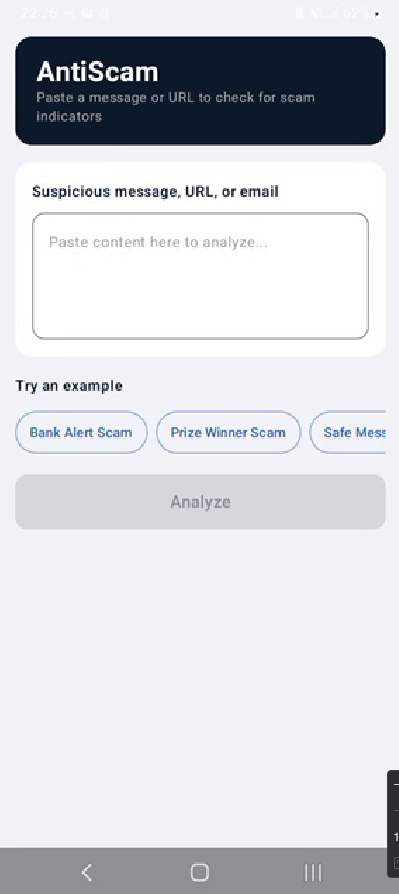
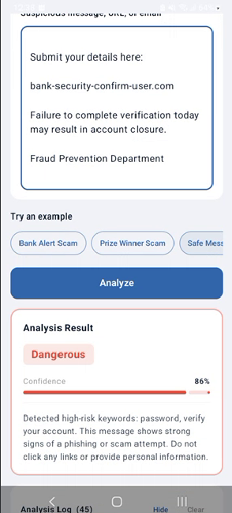
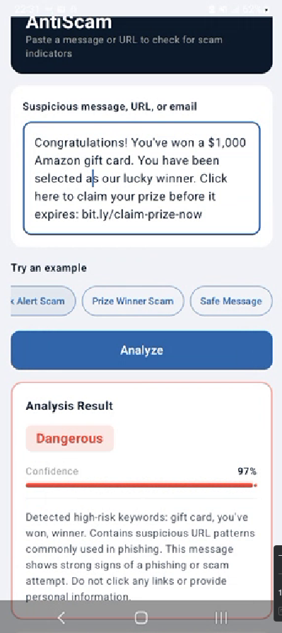
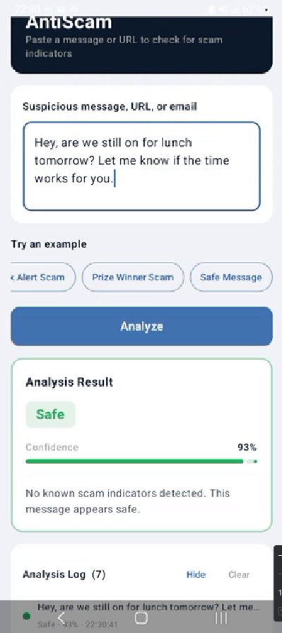

# AntiScam


AI-first Android scam message detector prototype inspired by **Norton Genie** / Gen Digital.

**Assignment Option B — Scam Message Detector**
**Repository:** `norton-aifirst-intern-krossale`

---

## 1. Project Overview

AntiScam is an Android prototype developed as part of the **Gen Digital AI-First Mobile Engineering Internship** assignment.

Inspired by Norton Genie, the app helps users identify potentially fraudulent content such as:

- SMS scam messages
- Phishing email snippets
- Suspicious URLs
- Social-engineering attempts using urgency, prizes, or fake account alerts

Users paste suspicious content into the app and receive an instant risk assessment:

- **Risk level** — Safe / Suspicious / Dangerous
- **Confidence score** — 0–100%
- **Explanation** — plain-language description of detected patterns

---

## 2. Features

- Paste suspicious messages, URLs, or email snippets
- Tap **Analyze** to run local heuristic analysis
- Risk classification: **Safe**, **Suspicious**, **Dangerous**
- Confidence score with visual progress bar
- Explanation of detected scam signals
- Three built-in example messages to demonstrate all risk levels
- Clean MVVM architecture
- Unit tests covering analysis logic and ViewModel

---

## 3. Architecture — MVVM

```
User Input
    ↓
ScamDetectorScreen (Compose UI)
    ↓
ScamDetectorViewModel
    ↓
ScamAnalyzer (domain logic)
    ↓
ScamAnalysisResult
    ↓
UI updates via StateFlow
```

| Layer     | File                       | Responsibility                                  |
|-----------|----------------------------|-------------------------------------------------|
| UI        | `ScamDetectorScreen.kt`    | Input, example chips, result card               |
| UI State  | `ScamDetectorUiState.kt`   | Holds current input text and analysis result    |
| ViewModel | `ScamDetectorViewModel.kt` | Coordinates input changes and analysis trigger  |
| Domain    | `ScamAnalyzer.kt`          | Keyword + URL heuristic analysis                |
| Domain    | `ScamAnalysisResult.kt`    | Result data class                               |
| Domain    | `RiskLevel.kt`             | SAFE / SUSPICIOUS / DANGEROUS enum              |
| Data      | `ExampleMessages.kt`       | Built-in example messages for demo              |

---

## 4. Project Structure

```
norton-aifirst-intern-krossale/
├── settings.gradle.kts
├── build.gradle.kts
├── gradle.properties
├── gradlew / gradlew.bat
├── gradle/
│   ├── libs.versions.toml
│   └── wrapper/
│       └── gradle-wrapper.properties
└── app/
    ├── build.gradle.kts
    └── src/
        ├── main/
        │   ├── AndroidManifest.xml
        │   ├── java/com/krossale/antiscam/
        │   │   ├── MainActivity.kt
        │   │   ├── data/
        │   │   │   └── ExampleMessages.kt
        │   │   ├── domain/
        │   │   │   ├── RiskLevel.kt
        │   │   │   ├── ScamAnalysisResult.kt
        │   │   │   └── ScamAnalyzer.kt
        │   │   ├── ui/
        │   │   │   ├── ScamDetectorScreen.kt
        │   │   │   ├── ScamDetectorUiState.kt
        │   │   │   └── ScamDetectorViewModel.kt
        │   │   └── theme/
        │   │       ├── Color.kt
        │   │       ├── Theme.kt
        │   │       └── Type.kt
        │   └── res/
        │       ├── drawable/
        │       │   ├── anti.svg           ← source icon (reference)
        │       │   ├── anti_logo.xml      ← converted VectorDrawable
        │       │   ├── ic_launcher_background.xml
        │       │   └── ic_launcher_foreground.xml
        │       ├── mipmap-anydpi-v26/
        │       │   ├── ic_launcher.xml
        │       │   └── ic_launcher_round.xml
        │       └── values/
        │           ├── colors.xml
        │           ├── strings.xml
        │           └── themes.xml
        └── test/
            └── java/com/krossale/antiscam/
                ├── ScamAnalyzerTest.kt
                └── ScamDetectorViewModelTest.kt
```

---

## 5. Requirements

| Tool             | Version    |
|------------------|------------|
| Android Studio   | Hedgehog+  |
| Android SDK      | API 35     |
| JDK              | 17 or 21   |
| Kotlin           | 2.0.21     |
| AGP              | 8.5.2      |
| Gradle           | 8.7        |
| Min SDK          | API 26     |

**No third-party libraries beyond the AndroidX / Jetpack Compose BOM.** All dependencies are standard Google/JetBrains packages.

---

## 6. Setup Instructions

```bash
git clone https://github.com/mathewtroy/norton-aifirst-intern-krossale.git
cd norton-aifirst-intern-krossale
```

Open in **Android Studio**:

```
File → Open → select the norton-aifirst-intern-krossale folder
```

Android Studio will:
1. Detect the Gradle project automatically
2. Download the Gradle wrapper (`gradle-wrapper.jar`) if missing
3. Sync all dependencies

---

## 7. Build and Run

**Run on emulator or device:**

```
Android Studio → select a device → click ▶ Run
```

**Build from terminal (after Android Studio has synced at least once):**

```bash
./gradlew assembleDebug
```

**Run unit tests:**

```bash
./gradlew test
```

Test results are in:
```
app/build/reports/tests/testDebugUnitTest/index.html
```

---

## 8. Screenshots

### Home Screen


---

### Analysis Result — Dangerous (Bank Alert Scam)


---

### Analysis Result — Dangerous (Prize Scam)


---

### Analysis Result — Safe


---

## 9. Testing

### ScamAnalyzerTest.kt (12 tests)
- Safe message → Safe risk level
- Phishing message with `password` + `bank account` → Dangerous
- `click here` phrasing → Suspicious
- Empty message → Safe, confidence 50
- Multi-keyword scam → confidence in 70–97 range *(AI-generated, reviewed)*
- Safe message → non-empty explanation
- Prize scam with shortened URL → Dangerous
- Shortened URL + urgency + prize → Dangerous
- Bank account + urgency combination → Dangerous
- Normal bank statement message → Safe
- Mixed-case keywords detected correctly → Dangerous
- Multiple URLs produce higher confidence than single URL

### ScamDetectorViewModelTest.kt (10 tests)
- Initial state: empty input, no result
- `onInputChanged` updates text and clears result
- Selecting an example message updates input *(AI-generated, reviewed)*
- Blank input → analyze does nothing
- Non-blank input → analyze produces a result
- Dangerous input → result is Dangerous risk level
- Changing input after analysis clears previous result
- Analyze appends entry to history log
- Multiple analyses build history in reverse order
- Clear history empties the log

```bash
./gradlew test
```

---

## 10. CI / CD

Added GitHub Actions CI workflow for automatic test execution.

The pipeline runs on every push to `main` / `develop` and on every pull request.

```
push / PR
    ↓
actions/checkout@v4
    ↓
actions/setup-java@v4  (Temurin JDK 17)
    ↓
gradle/actions/setup-gradle@v3
    ↓
./gradlew test
    ↓
BUILD SUCCESSFUL
```

Workflow file: `.github/workflows/android-ci.yml`

---

## 11. AI Interaction Log

### Prompt 1 — Project scaffolding

**Prompt:**
> "Set up a minimal Android Jetpack Compose project skeleton for a scam message detector app. Use MVVM, package name com.krossale.antiscam, AGP 8.5.2, Kotlin 2.0.21, Compose BOM 2024.12.01. Create the Gradle files, AndroidManifest, and the MVVM layer stubs."

**Result:** Full project structure including build files, manifest, and Kotlin stubs generated correctly on the first attempt.

**Notes:** Accepted as-is. AGP 8.5.2 + Gradle 8.7 combination was already validated as a stable pairing.

---

### Prompt 2 — Heuristic analysis engine

**Prompt:**
> "Implement ScamAnalyzer.kt with local keyword and regex-based heuristic analysis. It should classify messages as Safe, Suspicious, or Dangerous. Use lists of dangerous keywords (password, bank account, gift card, bitcoin...) and suspicious keywords (click here, act now, limited time...). Also detect suspicious URL patterns: IP-based URLs, shortened URLs (bit.ly, tinyurl), and suspicious TLDs (.xyz, .top, .click). Return a confidence score 0-100 and a plain-language explanation."

**Result:** Complete ScamAnalyzer with keyword lists, regex patterns, and explanation builders generated correctly.

**Notes:** Refined the confidence scoring formula to cap at 97 instead of 100 (leaving room for real AI integration later). Added a few extra keywords based on real phishing examples.

---

### Prompt 3 — Compose UI screen

**Prompt:**
> "Create ScamDetectorScreen.kt using Jetpack Compose Material3. It should include: a dark navy header card with 'AntiScam' title, an OutlinedTextField for input, a LazyRow of OutlinedButton example chips, a full-width Analyze Button, and a ResultCard that shows risk level badge, confidence LinearProgressIndicator, and explanation text. Use the color scheme from our theme: Navy, Blue, SafeGreen, SuspiciousAmber, DangerousRed."

**Result:** Full Compose screen generated with correct Material3 APIs including HorizontalDivider, LinearProgressIndicator with lambda progress, and BorderStroke.

**Notes:** Rejected the original suggestion to use `Divider` (deprecated in Material3) and replaced with `HorizontalDivider`. Also removed an unnecessary `isAnalyzing` loading state — not needed since local analysis is instant.

---

### Prompt 4 — Unit test generation

**Prompt:**
> "Generate unit tests for ScamAnalyzer and ScamDetectorViewModel. Tests should cover: safe message → Safe, phishing message with password/bank account keywords → Dangerous, 'click here' → Suspicious, empty message → Safe with confidence 50, multi-keyword scam confidence range, example selection updates ViewModel input, analyze on blank does nothing, analyze produces non-null result, changing input clears previous result."

**Result:** All tests generated correctly. No extra test dependencies needed since ViewModel uses synchronous analysis (no coroutines).

**Notes:** Marked AI-generated tests with `// AI-generated test — reviewed and refined by developer` comment. Added two additional edge-case tests myself (safe message has non-empty explanation, prize scam with URL returns Dangerous).

---

### Prompt 5 — SVG to VectorDrawable conversion

**Prompt:**
> "Convert anti.svg to an Android VectorDrawable XML. The SVG has a drop-shadow filter (not supported in VectorDrawable), a dark rounded rect background (x=4 y=0 w=48 h=48 rx=10 fill=#281E1E), and a shield/antenna path (fill=#3266AA stroke=#E2DDD0). Produce the VectorDrawable path data for the rounded rect using arc commands, and preserve the original logo path data."

**Result:** VectorDrawable generated with correct arc path for the rounded rect. Drop shadow filter correctly identified as unsupported and removed.

**Notes:** Verified the arc path `M14,0 H42 A10,10 0 0 1 52,10 V38 A10,10 0 0 1 42,48 H14 A10,10 0 0 1 4,38 V10 A10,10 0 0 1 14,0 Z` manually. AI also created the adaptive launcher icon structure using foreground/background layers.

---

## 11. AI Code Review Summary

### Feedback received

- **Unused `isAnalyzing` state** — suggested removing it since local analysis is synchronous. **Accepted** — removed from UiState.
- **`Divider` deprecated** — recommended `HorizontalDivider` from Material3 1.3+. **Accepted.**
- **`progress` lambda form** — recommended the `progress = { ... }` lambda over the deprecated `progress = Float` form for `LinearProgressIndicator`. **Accepted.**
- **`collectAsStateWithLifecycle`** — suggested using it instead of `collectAsState()`. **Rejected for now** — requires `lifecycle-runtime-compose` dependency; `collectAsState()` is sufficient for this prototype.
- **Dependency injection for ScamAnalyzer** — suggested using Hilt. **Rejected** — the assignment scope does not require DI, and keeping it simple makes the code easier to explain in the demo video.

### Changes made after review

- Removed `isAnalyzing: Boolean` from `ScamDetectorUiState`
- Replaced `Divider` with `HorizontalDivider`
- Updated `LinearProgressIndicator` to lambda-form `progress`

---

## 12. Reflection

### What I learned

- The Compose Compiler Plugin moved to a separate artifact in Kotlin 2.0 (`org.jetbrains.kotlin.plugin.compose`) — this is a breaking change from Kotlin 1.x projects.
- Android VectorDrawable does not support SVG `<filter>` elements (drop shadows must be removed or approximated with layered paths).
- Adaptive launcher icons (`mipmap-anydpi-v26`) with `minSdk = 26` eliminate the need for density-specific PNG fallbacks.
- Keeping the ViewModel analysis synchronous (no `viewModelScope`) simplifies testing significantly — no need for `kotlinx-coroutines-test` or `InstantTaskExecutorRule`.

### What worked well

- AI scaffolding of the Gradle version catalog (`libs.versions.toml`) with correct AGP/Kotlin/Compose BOM combinations was accurate and fast.
- The heuristic keyword approach is simple enough to explain in under 60 seconds during a demo.

### What I would improve with more time

- Integrate a real AI API (Claude or OpenAI) for smarter detection
- Add message history with Room persistence
- Add haptic feedback on Dangerous results
- Improve URL detection with a proper domain reputation check
- Add screenshot tests with Paparazzi

---

## 13. Demo Video

[Insert YouTube / Loom link here]

---

## 14. Author

**Name:** Aleksandr Kross
**Email:** krossale@fel.cvut.cz
**GitHub:** https://github.com/mathewtroy
**Project:** Gen Digital AI-First Internship Assignment — Option B
